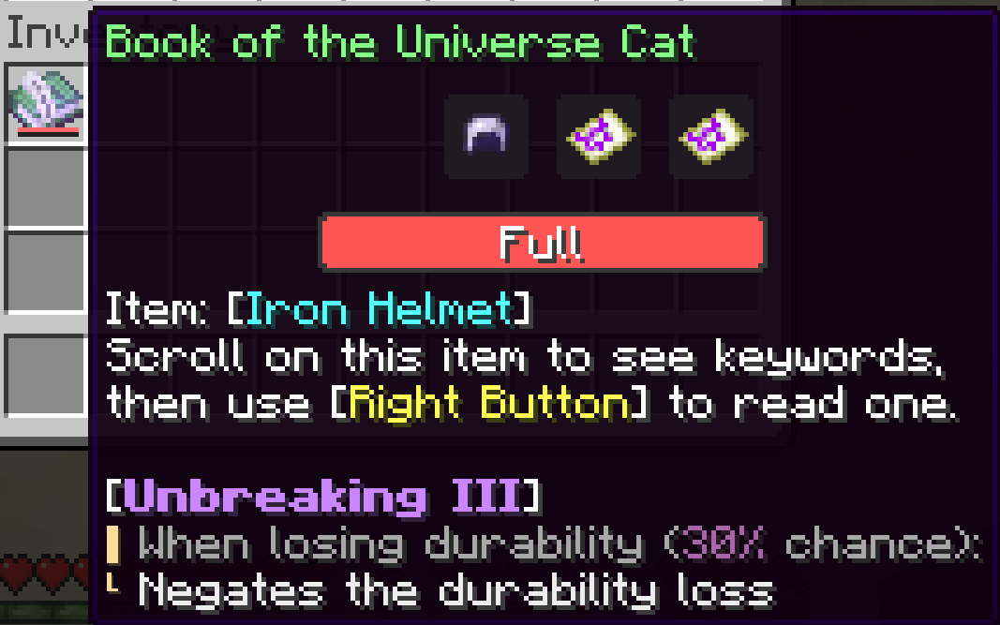
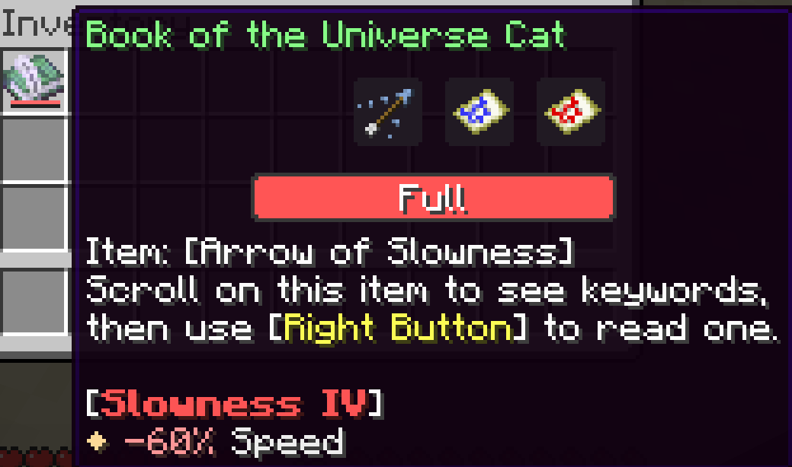
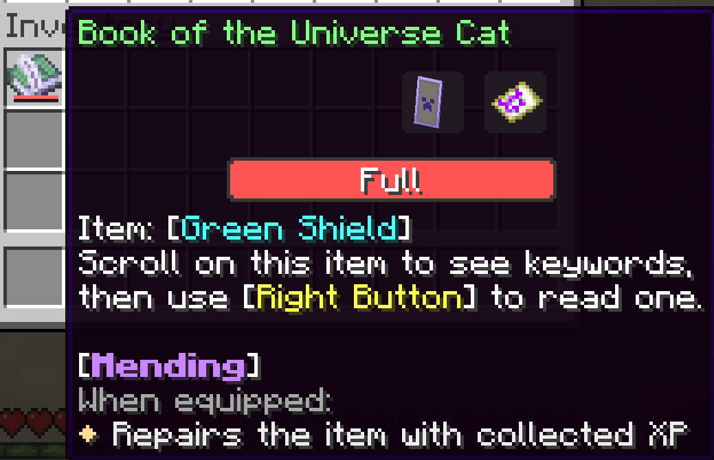

# Codex

[](https://github.com/merak48763/mc-codex/releases/latest)

Adapted from the Lexica module of [pearuhdox/Cartographer-2.0](https://github.com/pearuhdox/Cartographer-2.0).  
Minecraft version: 1.21.5 ~ 1.21.10

# Get the Book

- The book is defined by `codex:book` loot table.
- You can implement your own mechanism to make the book accessible to map players.
  - `/trigger lexica` in the Lexica system is a good example.
- The book doesn't work on creative mode players.

# Differences from Lexica

- Codex defaults to display vanilla features instead of Cartographer-rebalanced ones.
- Codex displays real level-based values instead of formulas.
  - e.g. `+12.5` instead of `+[lvl * 2.5]` for Smite V.
- Codex displays related keywords in the same page instead of creating additional pages for keywords.
- Codex displays a more precise item name.

# Showcase







# Mcdoc

Mcdoc is a feature of VSCode [Spyglass extension](https://marketplace.visualstudio.com/items?itemName=SPGoding.datapack-language-server).  
If you're using the extension, you can copy `mcdoc/` folder to the root of your workspace.  
It provides syntax highlighting and autocompletion of data structures provided by this pack.

# API

## Define Descriptions

Descriptions are defined under the `root` tag in command storage `codex:archives`.

### Data structure

> [!Important]
> Unlike real registries, the `minecraft:` namespace of archive IDs **cannot** be omitted anywhere.

- `<A namespaced ID>`: A description
  - `title`: **\[Text component\]** The title of the description.
  - `button_color`: **\[Optional int\]** The color of GUI element, which uses `filled_map` item model. Defaults to `4603950` (`#46402e`, defined in `filled_map` item model).
  - `details`: **\[List of text components\]** The description lines. Like the `lore` component, `\n` is not treated as newline.
  - `bullets`: **\[List of strings\]** Each entry is one of `none`, `dot`, `section_header`, `section_content`, `section_content_continued`, `section_last_content`, `indent`. Determines the decoration of the corresponding description line
  - `base_style`: **\[Optional text style\]** The common style applied to every line of `details`. Defaults to `{color: "#f0f0f0", italic: false}`.
  - `context_type`: **\[Optional string\]** One of `none`, `enchantment` and `effect`. Determines how to interpret the *context number*. Defaults to `none`.
    - `"none"`: This description doesn't chage.
    - `"enchantment"`: The title & description lines may change based on a value starting from 1 (enchantment level).
    - `"enchantment_lv1"`: The title & description lines may change based on a value starting from 1 (enchantment level). The title reflects the behavior of enchantments with max level = 1.
    - `"effect"`: The title & description lines may change based on a value starting from 0 (effect amplifier).
  - `insertions`: **\[Optional list of *insertion object*s\]** When present, generate a `with` list based on the *context number*. The `with` list is then inserted into all `details` lines.

### Insertion Object

- `type`: **\[Optional string\]** One of `text`, `lookup` and `value_check`. Defaults to `text`.
  - `"text"`: Provides a text component unrelated to the *context number*.
  - `"lookup"`, `"value_check"`: Provides a text component based on the *context number*.

When `type: "text"`:

- `value`: **\[Text component\]** The insertion text.

When `type: "lookup"`:

- `values`: **\[List of text components\]** Entries will be selected based on the *context number*. The first entry is for enchantment level 1 / effect amplifier 0.
- `fallback`: **\[Text component\]** The text to display if the *context number* is too large that the text is not defined in `values`.
- `generic`: **\[Text component\]** The text to display if the *context number* is not provided.
- `base_style`: **\[Optional text style\]** The text style to apply on the generated text.

When `type: "value_check"`:

- `threshold`: **\[Int\]** The value to compare with the *context number*.
- `on_pass`: **\[Text component\]** The text to display if *context number* ≤ threshold.
- `on_fail`: **\[Text component\]** The text to display if *context number* > threshold.
- `generic`: **\[Text component\]** The text to display if the *context number* is not provided.
- `base_style`: **\[Optional text style\]** The text style to apply on the generated text.

### Example

```mcfunction
# Defines the description of Smite enchantment
data modify storage codex:archives root."minecraft:enchantment/smite" set value { \
  title: {translate: "enchantment.minecraft.smite", color: "#cc88ff", bold: true}, \
  button_color: 11141375, \
  details: [ \
    {translate: "codex.desc.enchantment.smite.1", fallback: "When attacking undead mobs:", color: "gray"}, \
    {translate: "codex.desc.enchantment.smite.2", fallback: "%1$s Damage dealt"} \
  ], \
  bullets: ["section_header", "section_last_content"], \
  context_type: "enchantment", \
  insertions: [ \
    { \
      type: "lookup", values: ["+2.5", "+5", "+7.5", "+10", "+12.5", "+15", "+17.5", "+20", "+22.5", "+25"], \
      fallback: {translate: "codex.generic.enchantment.smite.1", fallback: "+[2.5 * lvl]"}, \
      generic: {translate: "codex.generic.enchantment.smite.1", fallback: "+[2.5 * lvl]"}, \
      base_style: {color: "#9999ff"} \
    } \
  ] \
}
```

## Describe Items

### Static Description

The `static_description` custom data on item can provide descriptions.  
`static_description` is a list of *index*es.

### Dynamic Description

There are currently 4 function tags that can be hooked on:

- `#codex:describe`: Called when describing any item.
- `#codex:describe/enchantment`: Called when describing an item which:
  - is enchanted, and
  - doesn't hide the enchantment tooltip text.
- `#codex:describe/stored_enchantment`: Called when describing an item which:
  - is an enchanted book,
  - is enchanted, and
  - doesn't hide the stored enchantment tooltip text.
- `#codex:describe/potion`: Called when describing an item which:
  - has potion content component, and
  - doesn't hide the potion content tooltip text.

In these functions, the following contexts are provided:

- Entity `@s`:
  - An item display holding the item to be described.
  - You can test its `contents` slot with some conditions.
  - **Don't** modify the item.
- The `root` tag under command storage `codex:inspecting_item`:
  - The copy of the item to be described.
  - You can do tests that are only possible through NBT checks.
  - You can retrieve NBT data from this storage to avoid repeated entity NBT serialization.
  - **Don't** modify the item.

To add description to the item, you can append an *index* to the `values` list of `codex_description_keys` command storage.

### Index

It can be either a string or a compound.

String: A description ID defined in the archive.

Compound:

- `id`: **\[String\]** A description ID defined in the archive.
- `context_number`: **\[Optional int\]** The *context number* provided to the description.
- `related_keywords`: **\[Optional list of *index*es\]** Related descriptions to show in the same page.

### Example (Static)

```mcfunction
# Get a paper with description
give @s paper[custom_data={static_description: ["minecraft:enchantment/smite"]}]
```

### Example (Dynamic)

```mcfunction
# Describes Bane of Arthropods enchantment on this item
data modify storage codex:description_keys values \
  append value {id: "minecraft:enchantment/bane_of_arthropods", related_keywords: [{id: "minecraft:effect/slowness", context_number: 3}]}
data modify storage codex:description_keys values[-1].context_number \
  set from storage codex:inspecting_item root.components."minecraft:enchantments"."minecraft:bane_of_arthropods"
```

# Resource Pack

Codex can work without the resource pack.

The resource pack provides the following features:

- Custom texture of the book.
- The ability to translate the content.
- The ability to customize the button textures.

## Translation

- All texts of Codex are translatable.
- You can find the translation files in `assets/codex/lang/`.

## Customize button texture

- Regular buttons use `filled_map` item model.
  - The archive ID is passed to `custom_model_data.strings[0]`.
- "Next page" button uses `feather` item model.
- "No information" button uses `barrier` item model.
- All buttons have special custom data, which can be isolated by `custom_data` item subpredicate.
  - The custom data test (in command form) is `custom_data~{codex: {type: "button"}}`.

### Example

```json
{
  "model": {
    "type": "condition",
    "property": "component",
    "predicate": "custom_data",
    "value": "{codex: {type: \"button\"}}",
    "on_false": {
      "type": "model",
      "model": "item/filled_map",
      "tints": [
        {"type": "constant", "value": -1},
        {"type": "map_color", "default": 4603950}
      ]
    },
    "on_true": {
      "type": "select",
      "property": "custom_model_data",
      "cases": [
        {
          "when": "minecraft:enchantment/smite",
          "model": {
            "type": "model",
            "model": "example:codex_button/enchantment/smite"
          }
        }
      ],
      "fallback": {
        "type": "model",
        "model": "item/filled_map",
        "tints": [
          {"type": "constant", "value": -1},
          {"type": "map_color", "default": 4603950}
        ]
      }
    }
  }
}
```

# Contribution

## Translation

Feel free to open a pull request for translations of this pack.  
There are some things to note when translating the pack.

- Some terms are very unlikely to need changes (e.g. `codex.formatter`). It doesn't matter if those terms are copied to the translation file.
- The following items/steps cover the important tests:
  - An enchanted book with all enchantments (the "Next Page" button will appear)
  - A regular tool with Unbreaking
  - A Turtle Shell with Unbreaking
  - All Tipped Arrows
  - A Lingering Potion of Harming
  - A Spectral Arrow
  - An Ominous Bottle
  - A Stone with `[!item_name, !custom_name]` (the "No Information" button & the "Unnamed Item" text will appear)
  - Hold the book in the cursor and pick two stacks of items (the "Found more than 1 item stack" message will appear)

### Currently Supported Languages

- `en_us` English (US): Built-in
- `zh_tw` 繁體中文 (台灣): Built-in
